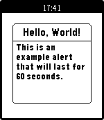

pebble-alert-lib
================

Source code for a simple alert mechanism for Pebble apps.

Instructions for Use:
---------------------

1. Copy the example/ext folder to your project folder.
2. Replace the wscript of your project but the example/wscript file (or adapt your wscript)
3. #include "alert.h"
4. Call alert_show(...) to shown alert.
5. Call alert_update(...) to update it.
6. Call alert_cancel() to remove it.

Issues?
-------
If you find any issues, please let me know!
