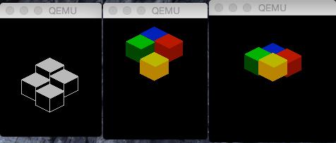

# pge-examples (blocks)

Animated isometric blocks demo written with [PGE](https://github.com/C-D-Lewis/pge).

## Other Examples

Switch between branches to see different examples.

See the main PGE repo for more information and documentation.