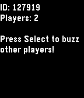

# pge-examples (websocket-buzz)

Simple multiplayer game for Pebble written with
[PGE](https://github.com/C-D-Lewis/pge). After running the `ws-server` with the
correct address passed to `pge_ws_begin()`, pressing Select will cause all other
player's watches to vibrate.

## Other Examples

Switch between branches to see different examples.

See the main PGE repo for more information and documentation.